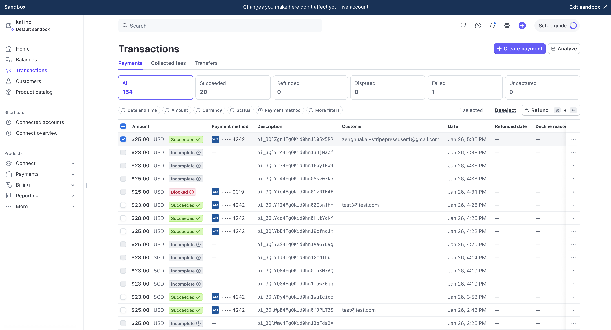

# stripe-press-bookstore

## How to Build, Configure, and Run

### Prerequisites
- Node.js (version 14 or higher)
- npm (version 6 or higher)
- Python (version 3.6 or higher)
- Flask
- Stripe account and Stripe keys

### Build and Run
1. Clone the repository:
    ```sh
    git clone https://github.com/moriatyk95/stripe-press-bookstore.git
    cd stripe-press-bookstore
    ```
2. Create a `.env` file in the `backend` directory and add your Stripe API keys:
    ```env
    STRIPE_PUBLISHABLE_KEY=your_publishable_key
    STRIPE_SECRET_KEY=your_secret_key
    ```
3. Make the `start.sh` script executable:
    ```sh
    chmod +x start.sh
    ```
4. Use the provided script to install dependencies and start both the server and client concurrently:
    ```sh
    ./start.sh
    ```
5. Open your browser and navigate to `http://localhost:3000` to see the application running.

## How Does the Solution Work?

### Stripe APIs Used
- **Stripe Payment Intents API**: This API is used to create and manage payment intents. It ensures that the payment process is secure and handles the complexities of different payment methods.
- **Stripe.js and React Stripe.js**: These libraries are used to securely collect payment details and handle the payment process on the client side.

### Application Architecture

- **Client**: The client, built with React, is located in the `frontend` directory. It includes the main UI components (shop, checkout, checkout form, and success). The frontend communicates with the backend to create payment intents and uses the payment intent's client secret to confirm payments.

- **Server**: The server, built using Flask, is located in the `backend` directory. It includes routes for creating payment intents and returning the payment intent's client secret to the client, as well as retrieving Stripe's publishable key. In a production environment, the server would also include additional routes. i.e. `get_book`, `create_cart`, and `delete_cart`.

- **Communication**: The frontend and backend communicate via HTTP requests. The frontend sends requests to the backend to create payment intents and retrieve the publishable key. The Flask application, with CORS enabled for the `api/config` and `api/create-payment-intent` routes, processes these requests and interacts with the Stripe API to perform the necessary actions. The payment intent client secret is fetched by the client to confirm the payment. Since this is a simple application without a database, there are no routes to retrieve book data. In a production application, an OLTP database would be used to store and manage book and other application data.

### Flow of the Application
1. The user visits the shop page and selects items to purchase.
    
2. The user proceeds to the checkout page, where they enter their payment details and select the payment method.
    
3. The frontend sends a request to the backend to create a payment intent.
4. The backend creates the payment intent using the Stripe Payment Intents API and returns the client secret to the frontend.
5. The frontend uses the client secret to complete the payment process using Stripe.js and React Stripe.js.
6. Upon successful payment, the success component renders and shows the user a message confirming payment is successful as well as displaying the total amount and payment intent id.
    
    
7. If the payment fails due to reasons such as card declined, insufficient funds, incorrect CVC, expired card, processing failure, or suspected fraud, an error message will be displayed with the reason for the failure. You can test these scenarios using Stripe's test cards.

## How I Approached This Problem

### Approach
1. **Understanding Requirements**: I began by thoroughly understanding the project requirements. After cloning the boilerplate and running the application to get a sense of its functionality, I noted that this is a relatively simple application. In a real-world scenario, there might be additional requirements. For instance, instead of a straightforward e-commerce platform selling books directly to customers, we might have a marketplace where users can be either merchants and customers. In such cases, it would be crucial to understand the specific requirements of the platform, such as the geographical locations of the users, preferred payment methods, and compliance with regulations like Strong Customer Authentication (SCA).

2. **Setting Up the Environment**: I decided to separate the client and server components of this application to better mimic real-world projects. Separating the frontend and backend offers several advantages, such as improved scalability, easier maintenance, and the ability to deploy them independently. This separation allows for a more modular architecture, where each part of the application can be developed, tested, and scaled individually. (I did not set up CI pipeline since this is a small application, but in real world application, set up a CI pipeline with test cases) Additionally, it aligns with best practices in modern web development, where microservices and decoupled architectures are becoming increasingly common.

3. **Development**: Refer to the official documents/videos to understand the main concepts such as creating a payment intent, confirming the client secret, and using the PaymentElement. Commit and push code in small increments, resolving issues as they arise. Identify areas that require further research, such as managing React states in the payment flow. After researching best practices, test the implementation with various scenarios (e.g., refreshing the page at checkout, returning to the shop to ensure expected behavior). Use the Stripe sandbox environment's transaction dashboard to verify the implementation.

5. **Testing**: All test card numbers for payment success as well as payment failure tested (Card Declined, Insufficient Funds, incorrect CVC, Expired Card, Processing failure, fraudulent)

### Documentation Used
- **Stripe Documentation**: 
  - [Stripe Payment Intents API](https://stripe.com/docs/api/payment_intents)
  - [Stripe.js and React Stripe.js](https://stripe.com/docs/stripe-js/react)
  - [Payment method integration options](https://docs.stripe.com/payments/payment-methods/integration-options)
  - [Element appearance](https://docs.stripe.com/elements/appearance-api)
- **Stripe Developers Youtube Channel**:
  - [Accept a payment - Create a PaymentIntent with Python](https://www.youtube.com/watch?v=3s4Dwox7oTQ)
  - [React Stripe.js and the Payment Element](https://www.youtube.com/watch?v=e-whXipfRvg)

### Challenges Encountered
1. **Managing State in React**: Managing state in React, particularly within the `CheckoutForm` and `CheckoutFormWrapper` component, presented several challenges. The complexity arose from the need to track multiple states. This required careful planning and the use of React's state management tools to ensure that the component remained responsive and the user experience was smooth.

2. **Handling Multiple Payment Methods**: Initially, I implemented the payment process using only the `CardElement` to quickly get the application up and running. However, to better reflect real-world scenarios, especially in regions like Southeast Asia and Greater China where payment methods such as PayNow, GrabPay, and Alipay are prevalent, I decided to support multiple payment methods. This necessitated refactoring the `CheckoutForm` component to use the `PaymentElement`, which supports a variety of payment methods.

3. **Modularization Adds Complexity**: Initially, I used a single `Checkout` component to handle payment confirmation on the client side. This approach made it easier to track different states, but the code became quite large. Following the take-home project's email instructions to structure the code in a more modular way, I broke the `Checkout` component into smaller components (`CheckoutForm` and `CheckoutFormWrapper`). While this improved code readability, it also increased the complexity of managing the payment flow on the client side.


## How I Might Extend This Application

### Understanding Platform Needs
Before extending the application, it's crucial to understand both the immediate and future needs of the platform. For instance, will it continue to be a simple online bookstore selling directly to customers, or will it evolve into a marketplace where other merchants and sellers coexist? Understanding the payment preferences of the shopists, and merchants, their regions, and additional integration requirements (e.g., Stripe webhooks for payment events, cross-border payments, tax calculations) is essential for planning the application's growth.

### Additional Features
1. **User Authentication and Authorization**: In a real world production application, implement user authentication and authorization to allow users to create accounts, log in, and manage their orders. This would involve integrating a user management system, such as Firebase Authentication or Auth0, and adding routes for user registration, login, and profile management.

2. **Database Integration**: Integrate a database (e.g., PostgreSQL, MySQL, MongoDB) to store and manage book data, user data, and order history. This would involve creating additional backend routes for CRUD operations on books, users, and orders. 

3. **Enhanced Payment Options for Southeast Asia and Cross-Border Transactions**: Support additional payment methods and currencies to cater to customers in Southeast Asia and facilitate cross-border payments with merchants in China. This involves configuring Stripe to accept popular regional payment methods such as Alipay, WeChat Pay, and GrabPay, as well as supporting multiple currencies. The application should be updated to allow users to select their preferred payment method and currency, ensuring a seamless payment experience for a diverse customer base.

4. **Testing and CI/CD**: Set up a comprehensive testing strategy, including unit tests, integration tests, and end-to-end tests. Additionally, implement a CI/CD pipeline to automate testing and deployment. This ensures that code changes are continuously tested and deployed, reducing the risk of bugs in production.

5. **Application Performance Monitoring (APM) and End User Monitoring**: Set up APM tools like Datadog to monitor the performance of the application and end-user experience. This helps in identifying and resolving performance bottlenecks.


